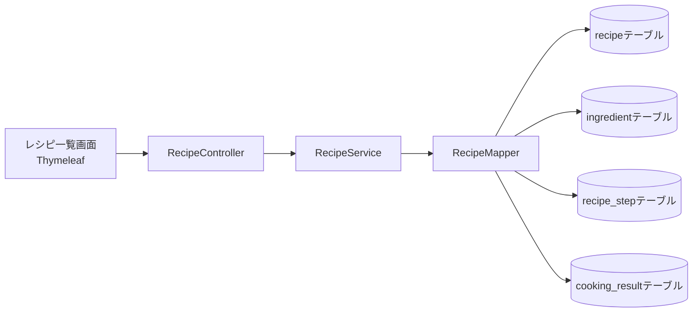

# 無水カレー管理システム ER図

```mermaid
flowchart LR

A[レシピ一覧画面<br>Thymeleaf] --> B[RecipeController]

B --> C[RecipeService]

C --> D[RecipeMapper]

D --> E[(recipeテーブル)]
D --> F[(ingredientテーブル)]
D --> G[(recipe_stepテーブル)]
D --> H[(cooking_resultテーブル)]
```
