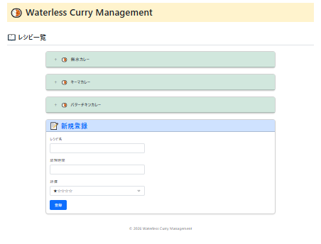
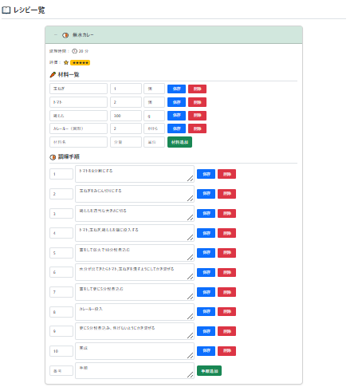
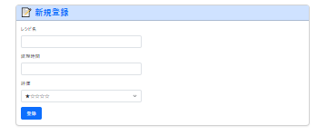
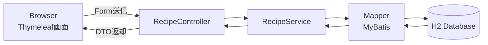
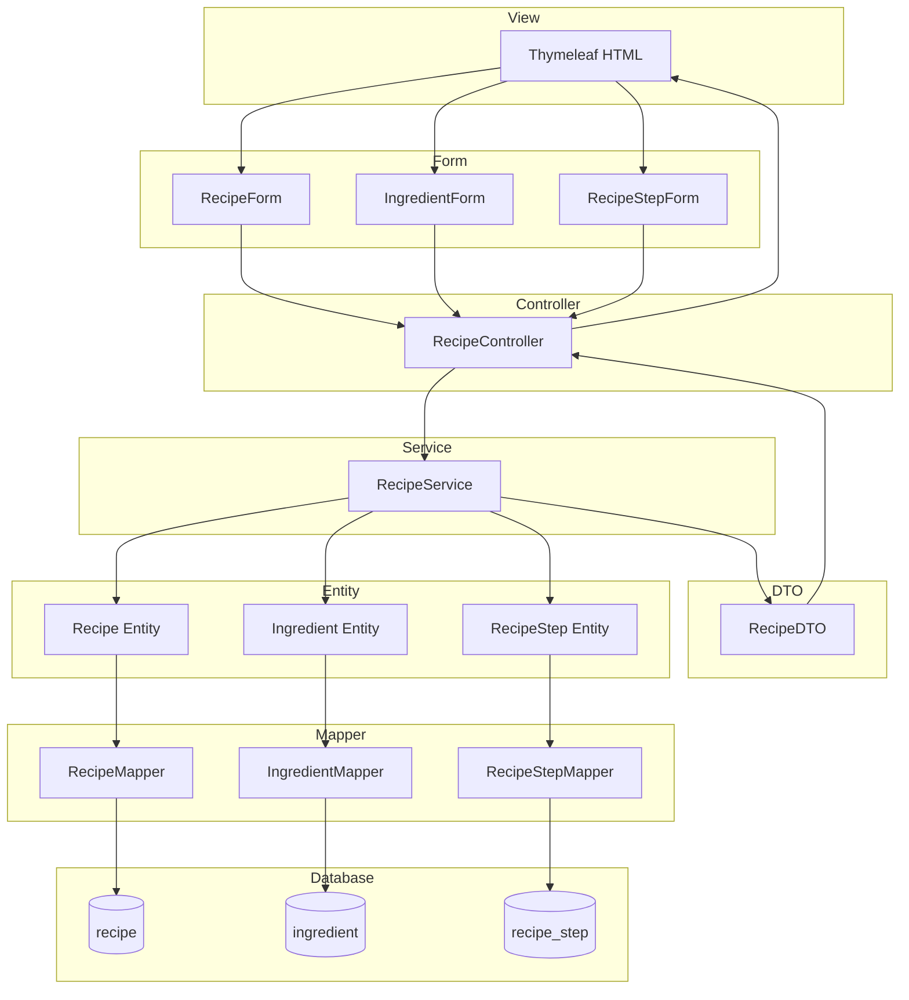
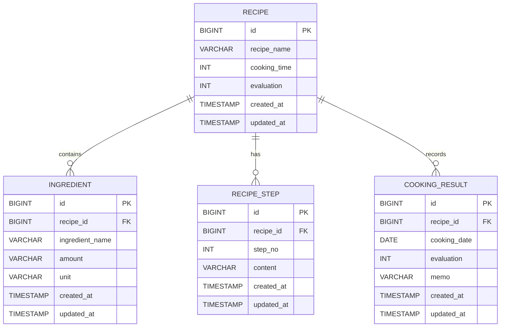

# 🍛 Waterless Curry Management

## 1. アプリ概要

Spring Boot・MyBatis・Thymeleafを用いて開発した、
無水カレーのレシピ・材料・調理手順・調理結果を管理するWebアプリケーションです。

データベース設計からバックエンド、画面実装まで一貫して実装しました。

## 2. 開発背景

自身が調理した無水カレーのレシピや調理結果を記録・管理することを目的として開発しました。  
単純なレシピ表示だけではなく、

- 材料管理
- 調理手順管理
- 調理結果記録

を行えるよう設計しています。

## 3. 使用技術

| 分類               | 技術                            |
| ------------------ | ------------------------------- |
| Backend            | Java 17                         |
| Framework          | Spring Boot 3.5.16              |
| ORM                | MyBatis                         |
| Template Engine    | Thymeleaf                       |
| Database           | H2 Database                     |
| Frontend           | HTML / CSS / Bootstrap 5.3.3    |
| Build              | Maven                           |
| Version Control    | Git / GitHub                    |
| Project Management | GitHub Projects / GitHub Issues |

## 4. 機能一覧

| 機能         | 内容                 |
| ------------ | -------------------- |
| レシピ管理   | 登録・一覧表示       |
| 材料管理     | 追加・更新・削除     |
| 調理手順管理 | 追加・更新・削除     |
| 調理結果管理 | 調理結果の登録・管理 |

## 5. 画面構成

### レシピ一覧画面

#### TOP画面



#### アコーディオン展開後



##### 新規登録



## 6. システムフロー



## 7. アプリケーション構成

### レイヤー構成



## 8. データベース設計

### ER図



---

### テーブル関係

#### recipe

レシピの基本情報です
| 項目 | 説明 |
| ------------ | ------------ |
| id | レシピID |
| recipe_name | レシピ名 |
| cooking_time | 調理時間(分) |
| evaluation | レシピの総合評価（1～5） |
| created_at | 登録日時 |
| updated_at | 更新日時 |

#### ingredient

レシピに必要な材料です
| 項目 | 説明 |
| --------------- | -------- |
| id | 材料ID |
| recipe_id | レシピID |
| ingredient_name | 材料名 |
| amount | 分量 |
| unit | 単位 |

#### recipe_step

調理手順です
| 項目 | 説明 |
| ----------- | --------- |
| id 　　　　 | 手順ID 　　　 |
| recipe_id　 | レシピID |
| step_no　　 | 手順番号 |
| content　　 | 手順内容 |

#### cooking_result

実際に調理した結果を管理します。

| 項目         | 説明         |
| ------------ | ------------ |
| id           | 調理結果ID   |
| recipe_id    | レシピID(FK) |
| cooking_date | 調理日       |
| evaluation   | 出来栄え評価 |
| memo         | メモ         |

#### Excelでの設計書はこちら

|  No  |   内容    |   設計書     | 
|------|-----------|-------------|
| 101  | [画面遷移図](https://view.officeapps.live.com/op/view.aspx?src=https%3A%2F%2Fraw.githubusercontent.com%2FTakeshiUeta%2FCurryRecipeManager%2Frefs%2Fheads%2Fmain%2FCurryRecipeManager%2Fdocs%2F01_design%2F101%25E7%2594%25BB%25E9%259D%25A2%25E9%2581%25B7%25E7%25A7%25BB%25E5%259B%25B3%2520.xlsx&wdOrigin=BROWSELINK) | 画面間の遷移 |
| 102  | [詳細画面設計書](https://view.officeapps.live.com/op/view.aspx?src=https%3A%2F%2Fraw.githubusercontent.com%2FTakeshiUeta%2FCurryRecipeManager%2Frefs%2Fheads%2Fmain%2FCurryRecipeManager%2Fdocs%2F01_design%2F102%25E8%25A9%25B3%25E7%25B4%25B0_%25E7%2594%25BB%25E9%259D%25A2%25E8%25A8%25AD%25E8%25A8%2588%25E6%259B%25B8.xlsx&wdOrigin=BROWSELINK)| 画面レイアウト・項目・処理概要 |
| 103 | [モジュール関連図](https://view.officeapps.live.com/op/view.aspx?src=https%3A%2F%2Fraw.githubusercontent.com%2FTakeshiUeta%2FCurryRecipeManager%2Frefs%2Fheads%2Fmain%2FCurryRecipeManager%2Fdocs%2F01_design%2F103%25E3%2583%25A2%25E3%2582%25B8%25E3%2583%25A5%25E3%2583%25BC%25E3%2583%25AB%25E9%2596%25A2%25E9%2580%25A3%25E5%259B%25B3.xlsx&wdOrigin=BROWSELINK) | レイヤー構成・クラス構成 |
| 104 |	[テーブル定義書](https://view.officeapps.live.com/op/view.aspx?src=https%3A%2F%2Fraw.githubusercontent.com%2FTakeshiUeta%2FCurryRecipeManager%2Frefs%2Fheads%2Fmain%2FCurryRecipeManager%2Fdocs%2F01_design%2F104%25E3%2583%2586%25E3%2583%25BC%25E3%2583%2596%25E3%2583%25AB%25E5%25AE%259A%25E7%25BE%25A9%25E6%259B%25B8.xls&wdOrigin=BROWSELINK) | テーブル・カラム定義 |
| 105 |	[システムフロー](https://view.officeapps.live.com/op/view.aspx?src=https%3A%2F%2Fraw.githubusercontent.com%2FTakeshiUeta%2FCurryRecipeManager%2Frefs%2Fheads%2Fmain%2FCurryRecipeManager%2Fdocs%2F01_design%2F105%25E3%2582%25B7%25E3%2582%25B9%25E3%2583%2586%25E3%2583%25A0%25E3%2583%2595%25E3%2583%25AD%25E3%2583%25BC.xlsx&wdOrigin=BROWSELINK) | 主要処理フロー |
| 106 |	[フォルダ構成](https://view.officeapps.live.com/op/view.aspx?src=https%3A%2F%2Fraw.githubusercontent.com%2FTakeshiUeta%2FCurryRecipeManager%2Frefs%2Fheads%2Fmain%2FCurryRecipeManager%2Fdocs%2F01_design%2F106%25E3%2583%2595%25E3%2582%25A9%25E3%2583%25AB%25E3%2583%2580%25E6%25A7%258B%25E6%2588%2590.xlsx&wdOrigin=BROWSELINK) | プロジェクト構成 |

## 9. 設計・実装で工夫した点

### レイヤードアーキテクチャ

Controller
Service
Mapper
Entity

の責務を明確に分離しました。

---

### DTO・Form・Entityの分離

画面入力
DBアクセス
画面表示

それぞれの責務を分離しました。

---

### MyBatisによるSQL管理

SQLをMapper XMLへ分離することで、
JavaコードとSQLの責務を明確化しました。

---

### Git Flowを意識したブランチ運用

feature単位で開発を進め、
developへ段階的にマージする運用を行いました。

---

### BootstrapによるUI改善

カードレイアウト
アコーディオン
レスポンシブ対応

---

## 10. Git運用

本プロジェクトでは、Git Flowを参考にしたブランチ運用を行いました。

### ブランチ構成

```text
main
└─develop
    ├─feature/setup
    ├─feature/entity-form-dto
    ├─feature/mapper
    ├─feature/service
    ├─feature/controller
    └─feature/view
```

### 運用内容

- GitHub Projects を利用したタスク管理
- GitHub Issues による機能単位の管理
- featureブランチごとに実装・レビュー・マージを実施
- developブランチへ段階的に統合し、安定した状態を維持

## 11. 起動方法

```bash
git clone https://github.com/TakeshiUeta/CurryRecipeManager.git
cd CurryRecipeManager
mvn spring-boot:run
```

## 12. 今後の改善予定

### Phase1（次期アップデート）

- 調理結果管理機能追加
- DBをファイル化してデータを永続保持
- レシピ画像登録
- Renderへデプロイ

### Phase2（機能拡張）

- CSV/TSVインポート
- CSV/TSVエクスポート
- ドラッグ＆ドロップアップロード
- 単体テスト追加
- テスト設計書作成

### Phase3（SPA化）

- Reactへ画面移行
- REST API化
- 再デプロイ

## 13. 学習・技術的な挑戦

本プロジェクトでは以下の点を意識しました。

- Spring Bootのレイヤードアーキテクチャ
- MyBatisによるSQL管理
- DTO・Form・Entityの責務分離
- Bootstrapを利用したUI改善
- Git Flowを意識したブランチ運用
- GitHub Projectsによるタスク管理
